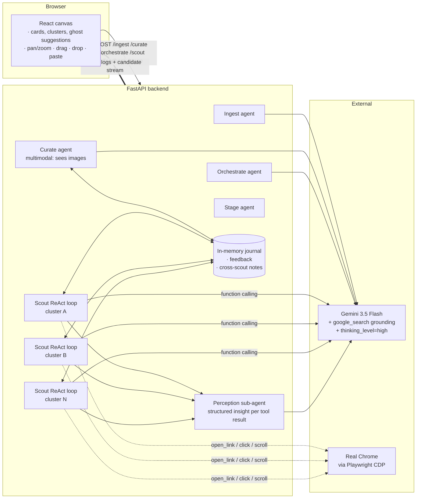
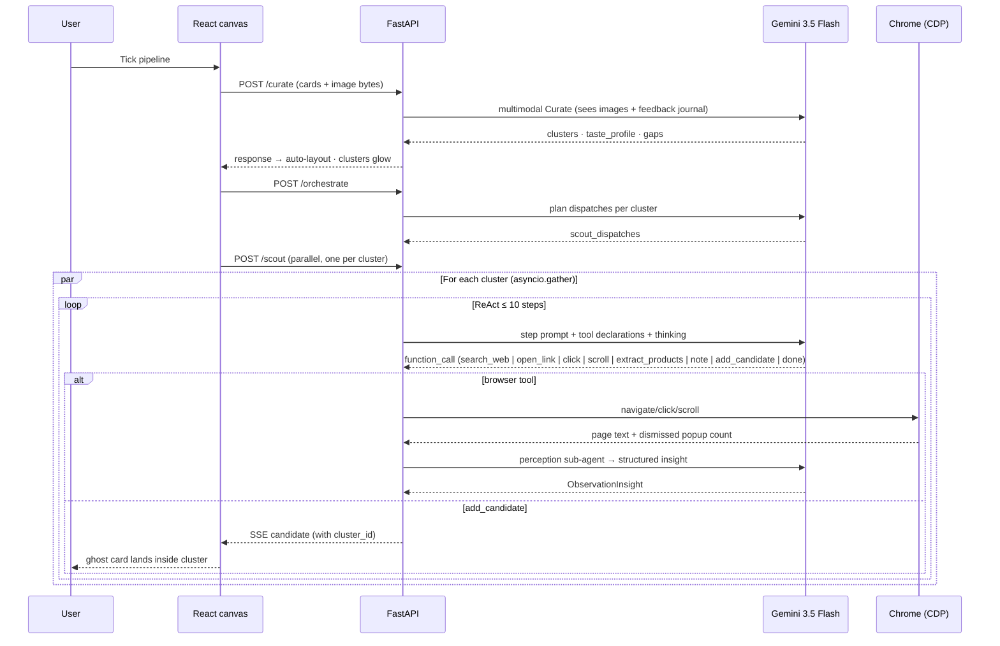

# Moodboard

**A spatial moodboard where Gemini 3.5 Flash agents actually browse the web on your behalf, in real Chrome, with a live taste-feedback loop.**

Drop URLs, images, emails, or notes onto an infinite canvas. The system clusters them, articulates your taste, and dispatches parallel ReAct agents that grounded-search the web, open real Chrome tabs, read the rendered pages, and commit candidates back to your board one at a time — while you watch them think.

Built for *Build Something That's Never Been Built Before with Gemini 3.5 Flash*.

---

## Why this is interesting

Most "agent" demos are pipelines pretending to be agents. The Scout here is a real ReAct loop with 7 composable tools, function calling, and `thinking_level="high"`. It drives **your visible Chrome** via Playwright CDP — the audience doesn't watch a spinner, they watch tabs open. Candidates stream back over SSE the moment each is verified. Dismissing one with a reason updates the taste profile in front of you.

This pattern — *dense per-user agent deployment with live browser-grade tools* — only becomes viable because Flash is fast and cheap enough to run 4-6 parallel reasoning loops per Tick, each doing 5-10 Flash calls with deep thinking. That's the bet.

---

## Architecture



### One Tick, end to end



### Codebase

```
backend/
  agents.py      # 5 agents + 7 scout tools + perception + Journal + browser context
  main.py        # FastAPI endpoints + SSE event stream
  models.py      # Pydantic shapes
frontend/
  src/
    App.tsx                       # state, SSE handling, lazy ingest, taste refresh
    components/Canvas.tsx         # infinite canvas, pan/zoom, cluster regions
    components/Card.tsx           # ingested card (sticky-note feel)
    components/SuggestionCard.tsx # ghost card with ★ star + dismiss-with-reason
    components/Sidebar.tsx        # User preferences (taste + gaps, glows on update)
    components/ActivityLog.tsx    # expandable thinking + tool calls + insights
    components/DropZone.tsx       # text/URL/image/.eml ingestion
```

---

## How it maps to the judging criteria

### Live Demo (45%)

Everything the audience sees is real, live, and load-bearing in the architecture:

- **Real Chrome opens visible tabs** as scouts decide to `open_link`. No mock, no replay. Connected via CDP to a Chrome you launched once with `--remote-debugging-port=9222`.
- **Activity log streams thinking summaries**, tool calls, perception insights, and structured observations — all expandable to show the model's actual reasoning, not just status text.
- **Cluster regions glow terracotta** while their scout is working, with a "scouting" pip in the label pill. Per-scout SSE start/end phases drive the highlight.
- **Suggestions stream onto the canvas** as ghost cards inside their cluster, the moment `add_candidate` fires — not batched, not buffered. Each gets a ★ Suggested badge and dashed terracotta border.
- **Dismiss with reason** opens an inline textarea on the ghost card; submitting POSTs `/feedback` and the User preferences panel **visibly glows sage** as the taste profile re-renders to reflect the constraint.
- **No image? Use an emoji.** The model proposes a single emoji per candidate as a visual fallback so the canvas never falls back to a sad gray box.

The whole flow — drop card → cluster → dispatch → reason → browse → commit → dismiss → re-curate — is one continuous, narratable arc that fits in 3 minutes.

### Creativity & Originality (35%)

- **ReAct loop driving real Chrome on a moodboard canvas** is the headline. Most agent demos either drive a browser (no UX context) or have a nice UX (no agent). This puts the agent's actions where the user already is — inside their cluster of saved things.
- **Perception sub-agent**: after every `open_link` or `extract_products`, a second Flash call summarizes the raw page into a structured `ObservationInsight {is_viable_lead, candidate_*, summary, next_action_hint}`. The parent ReAct loop reasons over insights, not raw HTML — dramatically reducing noise and tokens.
- **Anti-loop nudge**: after 4 searches/opens without a commit, the step prompt screams `STOP RESEARCHING — call add_candidate with the strongest lead from observations NOW.` Combined with a `[STATUS CHECK @ STEP N]` every 5 turns asking *"CAN ANY CANDIDATE BE COMMITTED?"*. Treats prompt as control flow, not just instruction.
- **Auto-popup dismissal**: every `open_link` runs ~20 selector patterns to clear cookie banners, GDPR consent, and newsletter walls before the model reads the page. If anything remains, the scout has a `click(text)` tool to dismiss it explicitly.
- **Suggestions as canvas-native ghost cards** instead of a separate panel. The taste-feedback loop is visually a part of the moodboard, not a sidebar afterthought.
- **Multimodal Curate**: image cards' actual pixels are sent to Curate (resized to 384px JPEG for token budget). Clustering reasons about what's *in* the picture, not just the extracted feature text.
- **Currency-aware grounding**: detects from `navigator.language`, passes through to the Scout's prompt, model converts source prices to the user's currency in `add_candidate`.

### Impact Potential (20%)

- **The pattern generalizes**: "drop heterogeneous artifacts → cluster → dispatch parallel research agents with real browser tools → stream verified results with a feedback memory" is a template for personal-AI workflows (research, shopping, planning, design).
- **Validates Flash's agentic economics**: 4-6 parallel scouts × 5-10 tool calls each × `thinking_level=high` per Tick was previously cost-prohibitive on frontier models. Flash makes per-user dense agent deployment viable.
- **Browser as a tool surface**: many of the most useful tasks live behind JS-rendered SPAs and authenticated pages. The CDP-attach architecture (vs. headless) reuses the user's logged-in sessions — practical, not just demoable.
- **Feedback memory as a primitive**: most agent systems have no notion of "the user already said no to that." The Journal pattern (with `recent_feedback()` injected into both Curate and Scout prompts as *hard constraints*) is a small, reusable foundation for learning what the user actually wants over time.

---

## Run it

```bash
# Backend
cd backend
echo "GEMINI_API_KEY=..." > .env
.venv/bin/python -m pip install -r requirements.txt
.venv/bin/playwright install chromium   # one-time, ~150 MB
.venv/bin/python -m uvicorn main:app --reload --port 8000

# Chrome (for live tab orchestration — optional but high demo impact)
'/Applications/Google Chrome.app/Contents/MacOS/Google Chrome' \
  --remote-debugging-port=9222 \
  --user-data-dir="$HOME/chrome-debug-profile2"

# Frontend
cd frontend
npm install
npm run dev   # → http://localhost:5173
```

Drop a few URLs or images. Hit **Tick pipeline**. Watch.

---

## Tech

`Gemini 3.5 Flash` (`google-genai` SDK · function calling · `thinking_level="high"` · `google_search` grounding · multimodal) · `FastAPI` + `sse-starlette` · `Playwright` (CDP attach + headless screenshot fallback) · `Pillow` · `React 19` + `Vite` + `Tailwind 3` + `@dnd-kit/core` + `lucide-react`.
